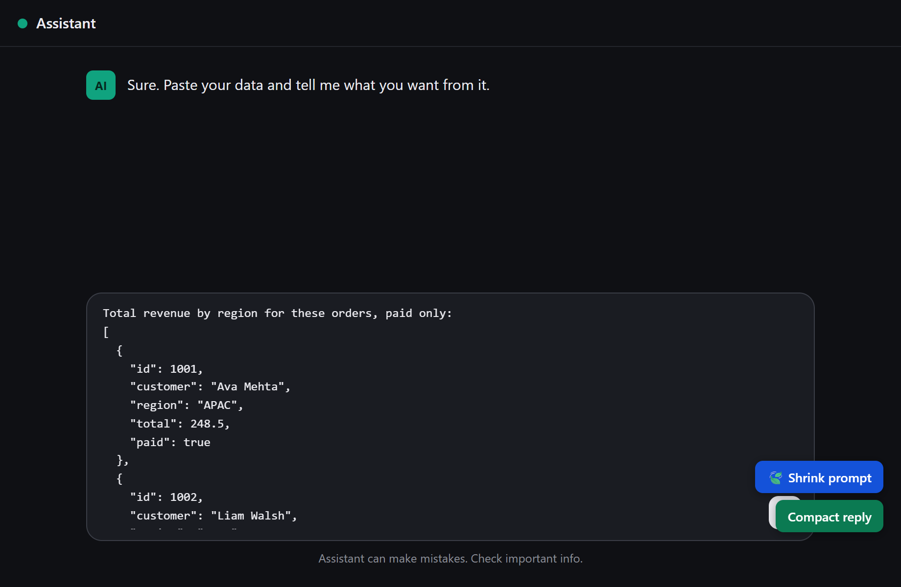

# TokenCodec

**The lossless codec for LLM prompts and data. Re-encode to a fraction of the tokens, then decode back byte-for-byte.**

**Try it live, no install:** https://sethiramicrosoft.github.io/tokencodec/

If an AI reads your words or data, you pay for every token. Most "prompt
compressors" shrink text by *summarizing or trimming* it - and quietly risk
changing what you meant. TokenCodec is different: it is a **codec**, a reversible
transform. It re-encodes the structured data in your prompt into a compact typed
table, and you can decode it back to the exact original - proven by an 8,000-trial
round-trip fuzz with zero data loss. Same facts, a fraction of the tokens, nothing
guessed and nothing lost.

It comes in pieces you can use together or alone:

- **The lossless engine** - re-encodes JSON/NDJSON data in a prompt to ~70% fewer
  tokens, fully reversible. Importable, or built into the tools below.
- **The rules installer** - one command that teaches your AI coding tools (Claude
  Code, Copilot, Cursor, Codex, Gemini, Aider) to stop wasting tokens by default.
- **The browser optimizer** - paste a prompt, see the savings, copy it back. Live
  at the link above; runs entirely in your browser.
- **The browser helper** - pick Copilot, Claude Code, or Codex, then use the same
  browser page to prepare a compressed prompt and the next step for that CLI.
- **The local proxy wrapper** - start a localhost proxy and launch supported CLIs
  through it so prompts are compressed before the model sees them.
- **The browser extension + API middleware** - shrink prompts inside ChatGPT,
  Claude and Gemini, or in your own backend at runtime.

Everything runs on your own computer. **Nothing is ever uploaded** - which matters
if your data is medical, financial, legal, or otherwise sensitive.

---

## 5 people who save the most

These are the cases where the savings are biggest *and* the tool already fits how
they work today:

1. **The full-stack / SaaS developer living in an AI agent.**
   All day in Claude Code, Cursor or Copilot. The agent re-reads 2,000-line files,
   reprints them to change five lines, and resends the whole conversation every
   turn - a 200-turn session bills ~24x more than it needs to. The installer makes
   "read only what you need, send small diffs, keep a compact state" the default.
   The difference between hitting your cap by noon and shipping all afternoon.

2. **The data scientist / analyst.**
   Pastes a 10,000-row CSV to ask "average by region?" and pays for all 10,000 rows.
   TokenCodec turns it into a 3-line query that returns only the answer - hundreds to
   thousands of times fewer tokens (the proofs measure 169x at 600 rows, 16,170x at
   60,000) - and when you must include data, shrinks it ~70% with
   zero values changed.

3. **The AI product builder / indie hacker shipping an LLM feature.**
   Burns tokens twice: building it *and* serving users. The installer cuts the
   build-time burn; the importable engine and its principles ("query, don't paste";
   "don't repeat"; "compact the data") cut the runtime burn when wired into the
   backend. At millions of calls, every trimmed prompt is a line-item saving.

4. **The auditor / accountant / financial analyst.**
   Drops whole ledgers and exports into AI to find anomalies or reconcile. The
   lossless shrink compacts the table **without altering a single number** - the
   part they can't compromise - and "query for the exceptions" returns only the
   rows that matter instead of re-reading the book on every question.

5. **The researcher / scientist with real datasets.**
   Exact numbers, reproducibility, no silent corruption. The codec is provably
   lossless (8,000-trial fuzz, zero loss), refuses rather than mangles unsafe
   values, and the proofs are runnable. And it all runs locally, so sensitive data
   never leaves the machine.

---

## The wider list - if your AI reads it, you're paying for it

| You are a... | Where your tokens go | What TokenCodec does |
|---|---|---|
| **Software / full-stack developer** | The AI agent re-reads whole files, reprints a 500-line file to change 3 lines, dumps giant build/test logs, and resends the entire chat every turn | The rules make it search and read only what it needs, send small diffs, trim logs, and keep a compact running state (kills the quadratic chat-history tax) |
| **Data scientist / analyst** | Pasting a 10,000-row CSV to ask one question makes the model read all 10,000 rows | Flags it and tells the AI to write a query, run it, return only the answer - **169x to 16,170x fewer tokens** in the proofs (600 to 60,000 rows) - and shrinks data you must include, losslessly |
| **Auditor** | Pasting whole ledgers and transaction logs to hunt for anomalies | Ask once, query for the exceptions, return only the flagged rows instead of the whole book |
| **Accountant** | Reconciling and summarising big financial tables | Shrinks the table **without altering a single number** (provably lossless), and turns "find the mismatches" into a query, not a full paste |
| **Business analyst** | Dumping dashboards and exports into AI for "what's the trend?" | Compresses the data and pushes the math into a query, so you pay for the answer, not the haystack |
| **Sales professional** | Pasting long call transcripts, email threads and CRM exports | Reads only the relevant slice and stops re-sending the whole thread on every follow-up |
| **Doctor / clinician** | Long patient notes, lab panels and papers pasted to ask a focused question | Reads only the section that answers it and compacts lab tables - and runs **entirely on your machine**, so nothing sensitive leaves it |
| **Engineer (any discipline)** | Sensor logs, bills of materials, simulation output | Lossless table shrink plus query-don't-paste for anything computable |
| **Scientist / researcher** | Exact numerical datasets where a wrong digit is unacceptable | A **proven lossless** codec that refuses rather than corrupts, with reproducible proofs and a precise numerical-fidelity contract (see below) |
| **Writer / student** | Pasting an entire document to ask one thing | The AI searches the text and reads only the part that matters |
| **Artist / worldbuilder** | Re-pasting a huge lore bible or style guide every message | Keeps that reference compact and stable instead of re-sending it each turn |
| **Executive / team lead** | Your whole team's AI bill, multiplied across every repo | Install once, enforce in CI with `--check` - cut spend without changing how anyone works |

The single idea behind all of it: **never make the AI read, reprint, or repeat
anything it doesn't have to.** TokenCodec just makes that the default.

---

## An honest note: who this serves *today*

Straight talk beats overselling:

- **Fully served now:** software & full-stack developers, data scientists, and
  anyone comfortable running a small local program. The installer plugs into AI
  coding agents; the engine and optimizer handle pasted data.
- **Served, with a catch:** auditors, accountants, analysts, doctors, lawyers,
  researchers and execs get real value from the optimizer and the
  "query-don't-paste" idea - but today that means running a local page or copying
  prompts by hand. Most non-technical users won't do that yet.
- **Now covered (new):**
  - Mainstream ChatGPT / Claude / Gemini users - the **browser extension** adds a
    one-click *Shrink* button right inside the prompt box.
  - **Production / runtime** spend - the **API-side compressor** (`middleware/`)
    shrinks prompts in your backend before they're billed.
  - **Log / export data** - the engine now also re-encodes **NDJSON / JSON-lines**.
- **Still not addressed (stated, not pretended):**
  - Tokens burned by **images, audio, PDFs and RAG retrieval** - the shrinker only
    compresses flat tabular JSON/NDJSON; prose and binaries are out of scope.
  - AI inside other surfaces (Office, Notion, Slack, IDE side-panels) - no
    integration yet.

"I burnt billions of tokens" means one of two different things. If it was your
**coding agent** while building, the installer is for you. If it's your **app at
runtime**, use the `middleware/` compressor - same ideas, different place.

## What's in the box

| Piece | Who it's for | Where |
|---|---|---|
| **Rules installer** | Anyone using an AI coding agent | `install.mjs` |
| **Lossless engine** (JSON + NDJSON -> table) | Importable anywhere | `engine.mjs` |
| **In-browser optimizer** | Anyone, no coding | `web/` (run `node serve.mjs`) |
| **Browser helper** | CLI users who want a friendly front door | `web/` (same page) |
| **Local proxy wrapper** | CLI users who want interception | `proxy.mjs` + `wrap.mjs` |
| **Browser extension** | ChatGPT / Claude / Gemini users | `extension/` |
| **API-side compressor** | Production apps burning tokens at runtime | `middleware/` |
| **Reproducible proofs** | Skeptics & researchers | `proofs/` |

### Which one should I use?

- **You just chat** (paste data into ChatGPT, Claude or Gemini): use the **hosted page**
  (zero install) or the **extension** (same codec, but it lives in the chat so you skip
  the copy-paste). Either one. The page also decodes a compact reply back for you.
- **You want interception** (run GitHub Copilot CLI, Claude Code or Codex through
  TokenCodec): use `node wrap.mjs <profile>` or `npm run wrap -- <profile>`.
- **You use an AI coding agent** (Copilot CLI, Codex, Claude Code, Cursor): run the
  **rules installer** once. From then on it is automatic - there is no button to click.
- **You build an app that calls an LLM API**: use the **middleware** to compress requests
  (and decode `@T1` replies) at runtime.
- **You just want the lossless table primitive**: import the **engine**.

### Quick start: intercept a CLI prompt

**Status:** CLI wrapper works for **Claude**, **Codex**, and **GitHub Copilot** (requires `copilot auth login` first).

#### For Claude and Codex (recommended):

```bash
git clone https://github.com/sethiramicrosoft/tokencodec.git
cd tokencodec
npm install

# Log in first
claude auth login    # or: codex auth login

# Run through the wrapper
npm run wrap -- claude
npm run wrap -- codex
```

Then ask a question with JSON data for best compression. You'll see:
```
[TokenCodec] Compression: 402 → 193 tokens (52% saved)
```

#### For GitHub Copilot:

**Setup (one-time):** First, authenticate the Copilot CLI:

```bash
copilot auth login
```

This stores your OAuth token locally. TokenCodec's proxy will read and use it automatically.

Then use the wrapper:

```bash
npm run wrap -- copilot -- -p "your prompt here"
```

Or for interactive mode:

```bash
npm run wrap -- copilot
```

**How it works:**

GitHub Copilot uses a two-stage OAuth flow:

1. **Storage:** `copilot auth login` stores a long-lived GitHub token (`gho_...`) locally.
2. **Exchange:** When making requests, the token is exchanged at `https://api.github.com/copilot_internal/v2/token` for a short-lived session token (~25–30 min TTL).
3. **Injection:** The session token is sent as `Authorization: Bearer ...` along with required editor headers to `https://api.githubcopilot.com`.

TokenCodec's proxy automates steps 1–3 internally:
- Reads the stored OAuth token from your system
- Performs the token exchange before each request
- Caches the session token and refreshes it before expiry
- Injects the session token and editor headers into upstream requests
- Compresses your prompt before GitHub sees it

#### Customize the wrapper

If you don't want the session contract, disable it:

```bash
TOKENCODEC_SESSION_PROMPT=off npm run wrap -- claude
```

To use a different model:

```bash
npm run wrap -- claude -- --model claude-3-5-sonnet
```


### The hosted page is live

The in-browser optimizer is published (free GitHub Pages) at
**https://sethiramicrosoft.github.io/tokencodec/** - zero install, works on any
device, nothing uploaded. It auto-redeploys whenever the web tool changes.

---

# Part 1 - The beginner path

No experience needed. Follow these in order.

## What you need first

**Node.js**, version 18 or newer. It's free.

1. Download it from **https://nodejs.org** (click the **LTS** button) and install.
2. Open a terminal (Windows: press Start, type **PowerShell**, Enter - Mac: open
   **Terminal**) and type:

   ```bash
   node --version
   ```

   A number like `v20.11.0` means you're ready.

## Step 1 - Download TokenCodec

Copy-paste these two lines, one at a time:

```bash
git clone https://github.com/sethiramicrosoft/tokencodec.git
cd tokencodec
```

(No `git`? On the GitHub page click the green **Code** button -> **Download ZIP**,
unzip it, then open that folder in your terminal.)

## Step 2 - Make your AI coding tools token-efficient

*(Skip to Step 3 if you don't use an AI coding agent.)*

Go into the project you build with AI, and run the installer from there:

```bash
cd /path/to/your-project
node /path/to/tokencodec/install.mjs
```

You'll see it create the rule files your AI already reads (`AGENTS.md`,
`CLAUDE.md`, `GEMINI.md`, `.github/copilot-instructions.md`,
`.cursor/rules/tokencodec.mdc`). **That's all.** Keep using your AI exactly as
before - it's now cheaper. Preview first with `--dry-run`; undo anytime with
`--remove`.

### Copilot CLI, Claude Code, or Codex? Install it once for every repo

These CLI agents each read a user-level instruction file for **every** session, in
any folder. One `--global` run installs the rules into all of them at once:

| CLI agent | User-level file it reads |
|---|---|
| GitHub Copilot CLI | `~/.copilot/copilot-instructions.md` |
| Claude Code | `~/.claude/CLAUDE.md` |
| OpenAI Codex CLI | `~/.codex/AGENTS.md` |
| Gemini CLI | `~/.gemini/GEMINI.md` |

```bash
node /path/to/tokencodec/install.mjs --global            # install into all of the above
node /path/to/tokencodec/install.mjs --global --dry-run  # preview first
node /path/to/tokencodec/install.mjs --global --remove   # undo (removes only our block)
```

From then on, every session in those agents runs token-efficient: it searches
instead of reading whole files, sends small diffs, trims tool output, queries data
instead of pasting it, and keeps its history compact. It only writes a small managed
block (your existing content in those files is preserved), and a tool you do not use
just gets an unused file that `--remove` cleans up. The per-repo install above also
covers all of these via `AGENTS.md`, `CLAUDE.md` and `.github/copilot-instructions.md`
- use `--global` when you want it everywhere by default.

#### Undo anytime - `--remove`

The installer never silently owns your files. Everything it writes goes between two
markers - `<!-- TOKENCODEC:START -->` and `<!-- TOKENCODEC:END -->` - so it can take
exactly that back out:

```bash
node /path/to/tokencodec/install.mjs --remove            # undo in this project
node /path/to/tokencodec/install.mjs --global --remove   # undo the user-level install
node /path/to/tokencodec/install.mjs --remove --dry-run   # preview what would be removed
```

What `--remove` does, precisely:

- **A file you already had** (e.g. your own `AGENTS.md`): it deletes only the marked
  block and leaves the rest of your file byte-for-byte.
- **A file only TokenCodec created** (e.g. `CLAUDE.md`, `GEMINI.md`,
  `.cursor/rules/tokencodec.mdc` with nothing but our block): it deletes the whole file.
- **A file it never touched:** left alone - it only acts on files containing its markers.

So installing and then removing returns your project to exactly where it started.

#### How a text file changes the agent's behavior

No magic, and worth being precise about:

1. **These agents load instruction files at the start of every session.** Copilot
   CLI reads `~/.copilot/copilot-instructions.md` (and `AGENTS.md`,
   `.github/copilot-instructions.md`, `CLAUDE.md`, ...); Claude Code reads
   `CLAUDE.md`; Codex/others read `AGENTS.md`. Whatever is in those files is placed
   into the model's context before it sees your first prompt.
2. **The installer puts nine plain, prioritized rules there** - search before you
   read, query data instead of pasting it, make small diffs, trim tool output, keep
   history compact, and so on. To the model they read as standing house rules for
   every task, exactly like the custom instructions you already write by hand.
3. **The model then applies them as it works.** When you say "fix the failing
   test," rule 1 nudges it to grep to the relevant lines instead of opening the
   whole file, rule 5 to surface just the failing log lines instead of the full
   dump, rule 6 to reply with a small diff. Same result, fewer tokens in and out.

**The honest limit:** these are *instructions the model follows*, not a hard switch
the runtime enforces. A capable model honors them most of the time, but not with
100% guarantee - so treat it as a strong, free nudge that compounds over long
sessions, not a contract. You can see the active rules any time with `/instructions`
or `/env` in Copilot CLI, and remove them with `--global --remove`.

## Step 3 - Shrink any prompt in your browser

Easiest way, nothing to install: **just open the hosted page** -
**https://sethiramicrosoft.github.io/tokencodec/** . Paste a prompt, or click
**Try a sample prompt**, and watch the token count and the dollar cost drop. It
runs entirely in your browser; nothing is uploaded.

**Prefer to run it locally?** (offline, air-gapped, or you cloned the repo to hack
on it.) From inside the `tokencodec` folder:

```bash
node serve.mjs
```

Open the link it prints (`http://127.0.0.1:8155/web/index.html`). Same page, served
from your own machine. Press `Ctrl+C` to stop.

The two are the *same tool* - the hosted page is the zero-install convenience; the
local server is for when you want it fully offline or are modifying the code. Both
run client-side and upload nothing.

---

## Why it works - the proof

Measured with a real tokenizer, fully reproducible. Run them yourself: the scripts
live in `proofs/` (`pip install tiktoken`, then `python proofs/<name>.py`).

| What you do | Before | After | Result | Proof |
|---|---|---|---|---|
| Shrink a 600-row data table (no data lost) | 49,082 tok | 12,519 tok | **74% smaller** | `lossless_proof.py` |
| Answer a question by querying data, not pasting it | 41,971 tok | 249 tok | **169x fewer** | `query_not_haystack.py` |
| The same at 60,000 rows | 4,188,096 tok | 259 tok | **16,170x fewer** (~$12,500 / 1,000 calls) | `query_not_haystack.py` |
| A 200-turn AI session, compact state vs resending history | 12,240,000 tok | 500,000 tok | **24.5x fewer** | `quadratic_tax.py` |

The savings are arithmetic (a tokenizer counts the same way every time), and the
data shrink is reversible - proven by 8,000 adversarial stress-tests with zero data
loss. It's not a lossy summary. It's the same information, written compactly.

---

> ### Beginners can stop here. Everything below is for power users, integrators and researchers.

---

# Part 2 - Power users & teams

## Command cheat-sheet

| Command | What it does |
|---|---|
| `node install.mjs` | Add the money-saving rules to this project |
| `node install.mjs --global` | Install for every repo at the user level: Copilot CLI, Claude Code, Codex, Gemini CLI |
| `node install.mjs --dry-run` | Show what would change, write nothing |
| `node install.mjs --check` | Exit code 1 if anything is missing/outdated - drop into CI |
| `node install.mjs --remove` | Undo: strip our marked block (keeping your own content), and delete files that were only ours |
| `node install.mjs --list` | List the files it manages |
| `node install.mjs --dir <path>` | Operate on another folder |
| `node serve.mjs` | Open the in-browser optimizer |
| `npm test` | Run the full test suite |

(`--check`, `--remove` and `--dry-run` all accept `--global` too.)

**For teams / orgs:** commit the generated files, then add `node install.mjs --check`
to CI. Every repo stays optimized, and a drifted or tampered rules block fails
the build. One policy, enforced everywhere, zero day-to-day friction.

## Use the engine in your own code or pipeline

The engine is a dependency-free ES module. Use it programmatically:

```js
import { optimize, tableEncode, tableDecode } from "./engine.mjs";

// Shrink a whole prompt (prose + any embedded JSON arrays) and get advisories:
const { optimized, passes, flags } = optimize(promptString);

// Or use the lossless codec directly on a list of flat records:
const wire = tableEncode(records);   // a compact string, or null if not safely convertible
const back = tableDecode(wire);      // structurally identical records
```

`tableEncode` returns **`null`** whenever it cannot guarantee a perfect round-trip.
Always handle that by keeping your original JSON - which is exactly what
`optimize()` does internally. Never assume conversion happened.

## Shrink prompts in production (runtime compressor)

If your *app* burns tokens serving users, compress messages right before you send
them. `middleware/compress.mjs` is dependency-free:

```js
import { compressMessages } from "./middleware/compress.mjs";

const { messages, saved } = compressMessages(rawMessages, {
  // optional: pass your real tokenizer for exact counts; defaults to an estimate
  // tokenizer: s => encode(s).length,
  skipRoles: ["system"], // leave certain roles untouched if you like
});
// `messages` is your same conversation, smaller. Send it as usual:
const reply = await openai.chat.completions.create({ model, messages });
```

It re-encodes embedded JSON/NDJSON losslessly and strips filler, so the model sees
the same facts for fewer tokens. Image/tool parts pass through untouched.

To cut the **reply** too, ask for an `@T1` table and expand it back to JSON on receipt:

```js
import { withRoundTrip } from "./middleware/compress.mjs";

// Compresses the request, adds OUTPUT_FORMAT_HINT so the model replies in @T1 for
// tabular answers, then decodes that reply back to JSON. `send` returns reply text.
const { text, stats } = await withRoundTrip(rawMessages, async (messages) => {
  const r = await openai.chat.completions.create({ model, messages });
  return r.choices[0].message.content;
});
// `text` is normal JSON your app can parse; the model billed you for the smaller @T1.
```

Or wire the pieces yourself: `OUTPUT_FORMAT_HINT` (a system-prompt string) and
`decodeResponse(text)` (expands any `@T1` in a reply, leaves prose untouched). There is
no lossless win for free-form prose - this helps when the answer is uniform records.

## Browser extension (ChatGPT / Claude / Gemini)

A tiny, fully offline add-on that puts two buttons next to the message box on
`chatgpt.com`, `chat.openai.com`, `claude.ai` and `gemini.google.com`: **Shrink prompt**
(input) and **Compact reply** (output). It runs the exact same lossless codec as
everything else here, just inside the page - so you can trim a data-heavy prompt, or ask
for a cheaper reply, in one click without leaving the chat.

### What it looks like

These come straight from a test run that loads the **real unpacked extension** into
Chromium and lets its content script act on a chat composer (`npm run screenshots`) -
the same `content.js` that runs on chatgpt.com, claude.ai and gemini.google.com. They
are the genuine extension, not mockups. The live chat sites need a login and block
automation, so the shots use a local chat-style composer; the floating buttons, the
in-place re-encode and the toast are all the actual extension.

**Before - you paste bloated JSON into the chat box. The extension adds two buttons, bottom-right:**



**After - one click on "Shrink prompt" re-encodes it in place to a compact `@T1` table, and a toast shows what you saved:**


### How it works

It is a single content script (`extension/content.js`, the engine inlined ahead of a
small UI). The browser injects it only on those four sites. No server, no account
access, no network call - the codec is bundled in.

1. **It adds one button.** On load it injects a floating "Shrink prompt" button and a
   status toast. These sites re-render constantly, so a `MutationObserver` re-attaches
   the button whenever the page rebuilds its DOM.
2. **On click it reads the prompt box you were typing in.** It remembers the last editor
   you focused and does not steal focus when the button is pressed, so even on a busy page
   with several editors (a sidebar search, hidden fields) it still targets your actual
   prompt - a plain `<textarea>` or a rich contenteditable editor like ProseMirror or
   Lexical (what Claude, Gemini and current ChatGPT use) - and pulls the text out.
3. **It runs `optimize()` on that text.** The same pass used everywhere: any JSON array
   or NDJSON/log block becomes a compact `@T1` table and filler is stripped. No value is
   ever changed, so the model sees the same facts for fewer tokens.
4. **It writes the smaller prompt back the right way, and checks it took.** Just setting
   `.value` would not register with these apps, so they would still send the old text. The
   script uses the native value setter plus a real `input` event for textareas, and
   `execCommand("insertText")` for rich editors, so the site's own state updates as if you
   had typed it. It then reads the box back to confirm the edit landed; if a site refuses
   programmatic edits, it copies the shrunk prompt to your clipboard and the toast tells you
   to paste it with Ctrl+V - it never fails silently or wipes what you typed. Then the toast
   shows roughly how much you saved (and, when relevant, a tip to ask the model to query the
   data instead of pasting it).

You stay in control: nothing is sent automatically. You click Shrink, see the smaller
prompt sitting in the box, and press send yourself.

**Output tokens too.** The second button, **Compact reply**, appends a short one-line
rule to your prompt so the model returns tabular answers as a compact `@T1` table
instead of verbose JSON - fewer output tokens, which are billed several times more than
input. It stays inside
the prompt box (a raw chat has no system-prompt field), so the privacy promise holds; to
read the compact reply, paste it into the hosted page's *"Shrink the reply too"* decoder.
Worth a few input tokens when you expect a list or table; for prose the rule says answer
normally.

### Install (about 30 seconds, no store needed)

1. `npm run build:ext` - generates `content.js` from the tested engine (only needed
   once, or after an engine change).
2. Open `chrome://extensions` (Chrome, Edge or Brave) and turn on **Developer mode**.
3. Click **Load unpacked** and pick the `extension/` folder.
4. Open ChatGPT, Claude or Gemini, click into the message box, and press **Shrink prompt**.

### Test it on your own account (about 60 seconds)

Those four steps are the whole test - there is no hidden setup, and this is exactly what
an end user does. To confirm it works for you: load the extension, open ChatGPT, Claude or
Gemini, click into the message box, and paste a JSON array such as:

```json
[{"id":1,"region":"APAC","total":248.5,"paid":true},{"id":2,"region":"EMEA","total":76,"paid":false}]
```

Press **Shrink prompt**. The box should collapse to a compact `@T1(...)` table and a toast
should report the tokens saved (see the [before/after screenshots](#what-it-looks-like)
above, which come from this exact flow). Press **Compact reply** to append the one-line
reply rule. Then press the chat's own send button yourself - the model reads the table
exactly as it read the JSON. If the toast says it could not find your box, click into the
box once and press Shrink again. If a site refuses an automated edit, the toast will say it
copied the shrunk prompt instead - just press Ctrl+V in the box.

Honest limits: the token counts in the toast are an estimate (~4 chars/token) to stay
fully offline - the savings are real, the exact figure depends on the model's tokenizer;
and the button is a best-effort overlay, so if a site changes its layout and it cannot
find your box, click into the box first, then press Shrink. If a site blocks programmatic
edits, it copies the result to your clipboard to paste rather than failing silently. It
only ever touches the text in the prompt box - never your account, history, or anything
else on the page. See `extension/README.md` for more.

---

# Part 3 - The losslessness contract (for high-stakes & scientific data)

If a wrong digit is unacceptable - lab measurements, genomic coordinates, dosages,
financial cents, reactor telemetry - read this. The guarantees are deliberately
conservative and honest about their edges.

- **Determinism.** Encode and decode are pure functions. The same input yields the
  same output on every machine, every run. No clocks, no randomness, no locale.
- **Round-trip guarantee.** For any input `tableEncode` accepts (returns non-null),
  `tableDecode(tableEncode(x))` equals `x` at the JSON-value level (object key order
  is normalised to the first record). Verified by an 8,000-case adversarial fuzzer
  covering commas, quotes, newlines, tabs, unicode, emoji and nulls, with zero
  failures. Reproduce with `npm test`.
- **Refuse, don't corrupt.** Rather than risk a silent error, the encoder declines
  (returns `null`, you keep JSON) on: nested objects/arrays, mixed-type columns,
  non-finite numbers (`NaN`, `+/-Infinity`), integers with `|x| > 2^53-1`
  (`Number.MAX_SAFE_INTEGER`), records with differing key sets, and reserved keys
  such as `__proto__`.
- **Numerical fidelity.** Floats are written with JavaScript's shortest
  round-trippable representation and parsed back with `Number()`, so every IEEE-754
  double survives bit-for-bit; `-0` is preserved. Integers are exact up to +/-2^53-1.
- **The boundary that matters (read this).** The codec operates on values that have
  *already passed through* `JSON.parse`. JSON stores every number as an IEEE-754
  double, so a 19-digit ID or a 40-significant-digit decimal in your source text is
  already approximated *before* TokenCodec ever sees it. The codec **refuses** such
  unsafe integers instead of emitting a mangled value, but it cannot restore
  precision JSON itself discarded. **For exact arbitrary-precision values, carry them
  as strings** - strings round-trip perfectly, every character.
- **Strict decode.** Decoding validates the format version, every type tag, row
  width, the boolean domain (`{0,1}`) and string quoting, and throws on any malformed
  frame rather than guessing.

## The wire format

JSON repeats every column name on every row. A header-once typed table doesn't:

```
@T1(name:s,score:i,csat:f,remote:b)
"Jordan Avery",87,4.6,1
"Sam Rivera",92,4.9,0
```

Header is `@T<version>(name:type,...)`, current version `1`. Types: `s` string
(always quoted; `"` doubled, control chars escaped), `i` integer, `f` float,
`b` boolean (`1`/`0`); null is the unquoted sentinel `\N` (a quoted `"\N"` is the
literal text).

## Does the model still read it correctly?

Lossless storage is one thing; an LLM answering just as well from the compact
table is another, so it is measured separately (`benchmark/`). On a 30-row set with
10 questions, GPT-5.4-mini scored **10/10 on the table, identical to JSON, at 54%
fewer tokens**; Claude Haiku 4.5 matched on every lookup/filter/compare task and
only slipped on raw multi-row arithmetic (a 30-number sum) - which you should
offload from the model anyway. Reproduce it yourself with `benchmark/benchmark.mjs`;
honest write-up and caveats in `benchmark/RESULTS.md`.

## Saving output tokens too

Output tokens are billed several times more than input - **4 to 8x** across current
frontier models (pinned in `benchmark/pricing.snapshot.json`; e.g. GPT-4o ~4x, Claude
~5x, GPT-5 ~8x). But output is fundamentally unlike input: the model *generates* it, so
it is not redundant data you can losslessly re-pack. Every output saving comes down to
making the model generate fewer tokens. Two honest levers, in order of reliability, and
one thing that does **not** help.

**1. Enforced - the API obeys these (the real mechanical lever).**

- **Lower the reasoning / "thinking" budget.** Reasoning-class models emit hidden
  reasoning tokens *before* the answer, billed at the output rate and routinely larger
  than the answer itself - this is what is behind most complaints about premium models
  burning tokens. Lower the budget (`reasoning_effort`, `thinking.budget_tokens`,
  `thinkingBudget` - check your provider's docs) and the bill drops, reliably, because
  the API enforces it. A cost/quality knob: low for routine work, high only when a task
  truly needs the deliberation.
- **Cap max output** (`max_completion_tokens` / `max_tokens`) and, where offered, lower
  **verbosity**.

**2. Best-effort - the model may or may not obey.**

The installed rules tell your agent to be brief, send small diffs instead of reprinting
whole files (the biggest output cost in agentic coding), and return uniform lists as a
compact `@T1` table. Measured (`benchmark/output_benchmark.mjs`): the 10-record answer is
**130 tokens as `@T1` vs 192 as compact JSON - 32% fewer** - decoding losslessly, with no
accuracy change per model for GPT-5.4-mini and Claude Haiku 4.5. Delivered through the
installed rules (CLI/Codex/Claude Code), the web *"Shrink the reply too"* panel, the
extension's *Compact reply* button, and the middleware's `OUTPUT_FORMAT_HINT`.

**What does not help: decoding.** `decodeTables` / `decodeResponse` expand a compact
`@T1` reply back into JSON, but that runs on your machine *after* the model generated and
you were already billed - it saves zero tokens. It is plumbing so your code can read a
reply you asked to be compact, not a discount.

The honest bottom line: input is a lossless codec; output is "ask for less", and the only
*enforced* way to ask for less is the budget and cap parameters above.

## Safety

- **Idempotent:** running it twice changes nothing the second time.
- **Surgical:** edits only its own marked block; your other content is untouched.
- **Reversible:** `--remove` deletes only what it added.
- **Contained:** never writes through a symlink or outside the target folder; never
  crashes on a bad target; repairs malformed blocks instead of duplicating them.

## Tests

```bash
npm test          # core: engine + installer + middleware (no browser needed)
npm run test:e2e  # end-to-end: artifacts-in-sync, server safety, proofs, and a real
                  # browser drive of the web tool + extension (needs Playwright/Chromium)
npm run test:all  # everything
```

What's covered, end to end:

- **Engine** (49 checks + an 8,000-trial lossless fuzz): JSON and NDJSON round-trip,
  hostile-input safety, the numeric/format guarantees in Part 3, and the receive-side
  `decodeTables` round-trip (expands `@T1` replies back to JSON, ignores non-tables).
- **Installer** (55 checks): idempotency, content preservation, `--check`, `--remove`
  (including `--remove --dry-run` previews nothing destructive), symlink refusal,
  malformed-block repair, directory-target handling.
- **Middleware** (21 checks): input compression is lossless and reports real savings;
  the output round-trip injects the format hint and decodes `@T1` replies back to JSON.
- **E2E node** (16 checks): the committed `web/index.html` and `extension/content.js`
  are in sync with `engine.mjs` (no drift), `serve.mjs` blocks path traversal, and the
  three proofs emit the exact numbers this README cites.
- **Claims** (every datapoint in this README, RESULTS.md and the web page): recomputed
  from the engine, the benchmarks and the pinned pricing snapshot, then asserted against
  the prose - so no number here can silently drift. The wire-format example is decoded to
  prove it is valid.
- **E2E browser** (27 checks): the web tool's displayed token counts equal a real
  tokenizer, the % and $ figures are arithmetically correct, the output decodes back to
  the original data (lossless), the model switch recomputes cost, copy confirms, the
  "Shrink the reply too" panel expands a compact `@T1` reply losslessly, and the actual
  `extension/content.js` is loaded into a real page where its "Shrink prompt" button
  losslessly compacts both a plain `<textarea>` and a contenteditable rich editor (the
  path ChatGPT/Claude use), it shrinks the editor you focused rather than a decoy search
  box when several share the page, it copies the result to the clipboard (and says so)
  when a box refuses an automated edit instead of wiping it, and its "Compact reply"
  button adds the `@T1` rule - all with zero console errors. (The live ChatGPT/Claude/Gemini
  sites are not driven - they need a login and block automation - so the content script is
  exercised against equivalent editors rather than the real pages.)

## License

MIT - free to use, change and share.
